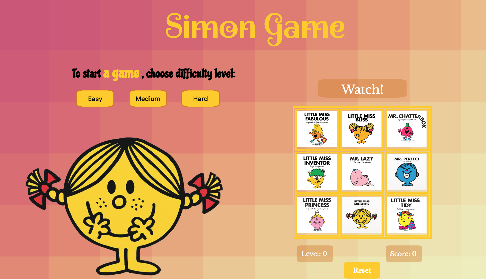

# Simon-Game
The simon game is a great exercise for training the memory while having fun. More you play more you are going to boost and improve your memory. 

There are 3 difficulty levels to choose from, thus player can start with the slow speed (easy level) and speed up if he/she feels more confident with the game logic. 

The series of illuminated keys is randomly generated, the player has to replicate the sequence, keeping the exact order. There is no time restriction between each sequence. 

## Technologies Used
* HTML
* CSS
* JS
  * Jquery

## Getting Started:
* https://dilyarayussupova.github.io/Simon-Game/
* To start a game, please choose difficulty level and press corresponding button.
* In both cases: win or loss, please press "RESET" button first, then click one of the buttons - Easy/Medium/Hard, to start a new round.

## Next Steps
* Planned features 
  * Responsive "Mobile-first" web page.
  * Congratulations animation with confetti --> when the player wins.
  * Customised alert modal box --> when the player either wins or losses.

<!-- ## User stories
* User can choose from easy, medium and hard levels of difficulty
* User sees gameboard
  * User sees message "Watch!" or "Play!"
  * User can keep track of current level 
  * User can see current score 
* User can click one of 3 buttons (Easy/Medium/Hard) to start a game
* User needs to replicate the sequence computer has displayed

## UI Notes
Main screen has 2 parts: on the left side is an image and level of difficulty; on the right side is a game board. Buttons "Level" and "Score" are underneath the board; as well as the "Reset" button. Box with instructions - watch or play; will be displayed above the game board.

## Pseudocode
* Difficulty level - easy/medium/hard:
    * Level = 1; Score = 0
    * Display "Watch!" message
    * Computer shows 1 round of sequence 
        * each selected card should change the opacity of the their background and illuminate border
    * Display "Play!" message
    * User needs to follow up the sequence by clicking each card with the correct order
        * each selected card should change the opacity of the their background and illuminated border
    * If user enters correct sequence of cards:
        * Modify score and level values
        * Reset for another round
    * If one of user's sequences is not correct then
        * Display message "Game Over"
        * Display "Restart" button
          * Reset previous results and sequence order
        * Display the highest score and current level
        
## Nice to have
* Audio - each card has the sound; winner/looser 

## State of the app
* computerSequence - holds computer's sequence (arr)
* userSequence - holds user's sequence (arr)
* variables to hold each round scoring and level 
* variables to hold id and class of each image within the board game table -->

